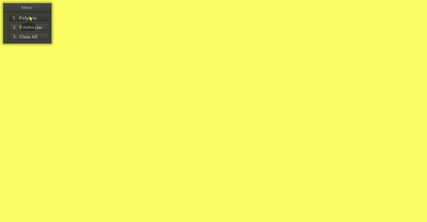

# Connect-the-Dots
Interactively sketching polylines and piecewise bezier curves from the input points using OpenGL.

## Supported actions
* Interactively connect the dots -- input using left mouse clicks. The dots are connected using a polyline by default, however, the selection can be changed using the menu on the top left corner.
* To add the final dot/point of the ensemble insert it with a right mouse click.
* After the last dot/point is added, the user can change the position of existing points on the canvas by clicking (left) over the point to move and dragging it to the desired position on the canvas.
* `Clear All` button in the menu clears the canvas.

## Application Demo
1. Polyline

2. Piecewise Bezier curves

## Execution
* Generate the object file:
	* `mkdir build && cd build`
	* `cmake ..\`
	* `make`
	* `cd ../`
* Execute the object file:
	* `./bin/connect_the_dots`
